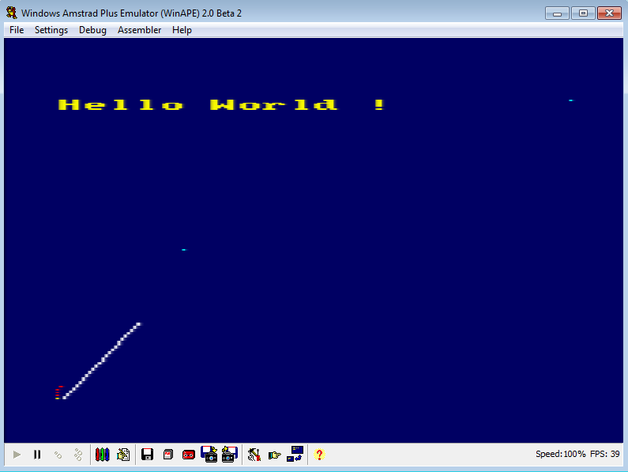

# [JDVA#2] Passage en mode 0 et tracé de point lent
# Tested by Renaud

Basé sur la vidéo CPC de Oldschool is beautiful : http://www.youtube.com/watch?v=xFnF3tZkzSs http://www.youtube.com/watch?v=Pe5cQzDEbfg

http://www.cantrell.org.uk/david/tech/cpc/cpc-firmware/ > Graphics

Je personnalise hello.c comme dans la vidéo, je patch _compil.bat pour obtenir jdva2.dsk en sortie.

Je patch _compil.bat avec l'ajout du paramètre "--oldralloc" afin que "LD A,4 (IX)" fasse son effet.

Je lance _compil.bat, j'obtiens jdva2.dsk

Je test : ça marche :)
