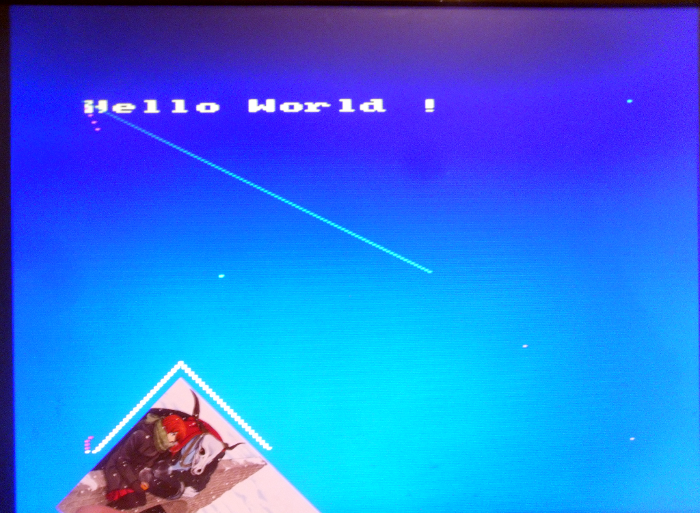

# [JDVA#3] Architecture de la mémoire vidéo en mode 0
# Tested by Renaud

Basé sur la vidéo CPC de Oldschool is beautiful : http://www.youtube.com/watch?v=wIFNeutEg8E

J'ai tapé le même code qu'avec plot() et move/line() via la nouvelle fonction put_pixel0()

On remarque que le Y (vertical) est inversé, et que la ligne de 100 pixels (boucle for) en diagonale va plus loin.

