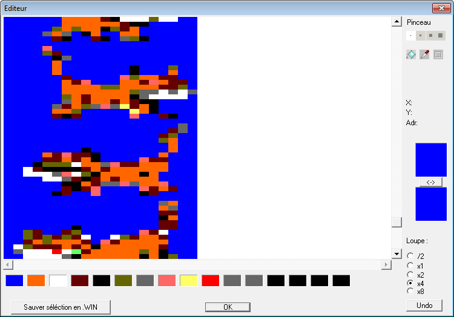

# [JDVA#4] CONVERSION D'IMAGES, RONDS ET POISSONS ROUGES
# Tested by Renaud

Basé sur la vidéo CPC de Oldschool is beautiful : http://www.youtube.com/watch?v=DQGPwtsD11o

Je modifie ConvImgCpc.exe grâce à PE Explorer afin d'agrandir la fenêtre en largeur, ainsi que la zone de log.

Je vais chercher des sprites, je prend par exemple Azrael :
https://www.spriters-resource.com/game_boy_advance/revengeofthesmurfs/sheet/60325/

Et je vais les mettre en vertical, sur disons une image de 100x1200, pour un objectif final de 50 en largeur, et l'hauteur de l'Amstrad en overscan disons 300 en hauteur (résolution 800x600 donc 800x300 mode 2 à peu près)
Chaque sprite sur des zones de 80 pixels en hauteur, alors sous Gimp on peut cliquer pour prendre la règle et relacher sur l'image, et poser ainsi des guides, tout les 80px.

Via paint j'enregistre en .bmp 256 couleurs. Je met une couleur en plus au fond, pour bah, mettre n'importe quelle couleur de fond ensuite dans le jeux ;)

Bon j'importe dans ConvImgCpc.exe, en cochant "overscan", pas de chance l'hauteur de l'overscan est 272, moi j'ai 300, je prend donc (8/10)*300=240 en hauteur et (8/10)*50=40 en largeur mode 2, heu donc 10 en mode 0 ?
Je clique sur "Calculer", ça calcul une palette, j'ai dans le log les inks de cette palette : 2,15,26,3,0,12,13,16,25,6,22,9,0,0,0,0.
Je la personnalise un peu : 2,15,26,3,0,12,13,16,25,6,13,13,0,0,0,0.

Quelques retouches avec l'éditeur, afin de retirer les pixels trop contrastés aux bords (les points blanc qui devaient être de la même couleur que le fond ici)

Je coche "Mode 'asm'" et "Linéaire", j'obtiens un fichier avec 8*300 valeurs donc 8*300=2400=240*10 valeurs, ça semble bon.

J'ai donc selon mon bmp des images de 20(*8/10)=16 en hauteur, sur 50(*8/10)=40 en largeur, donc sur CPC j'ai 15 chats de 16x10 pixels :)

Ajout d'un Gargamel, de 120x23 pixels, via blocage de la palette azrael (save/load palette azrael, clique sur les boutons à cocher sous les couleur, calculer)
