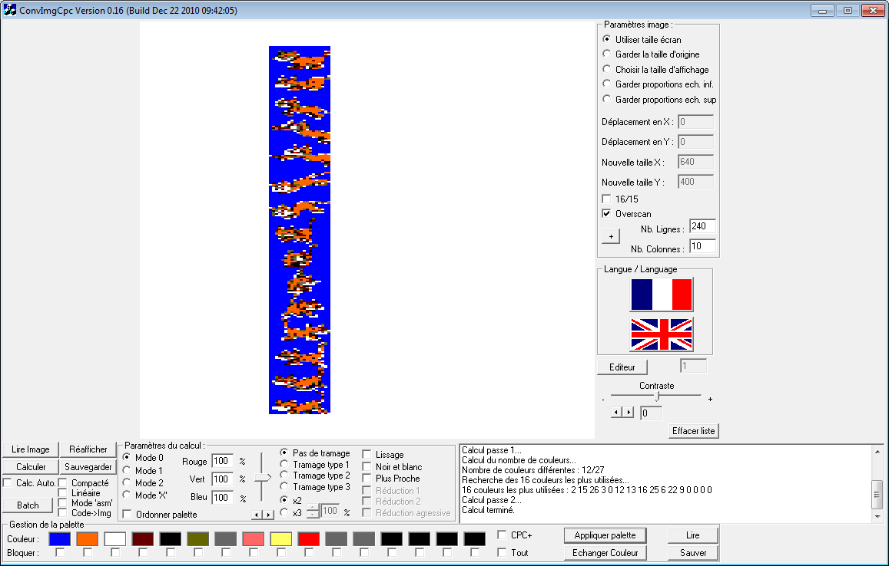

# [JDVA#3] Architecture de la mémoire vidéo en mode 0
# Tested by Renaud

Basé sur la vidéo CPC de Oldschool is beautiful : http://www.youtube.com/watch?v=DQGPwtsD11o

Je modifie ConvImgCpc.exe grâce à PE Explorer afin d'aggrandir la fenêtre en largeur, ainsi que la zone de log.

Je vais chercher des sprites, je prend par exemple Azrael :
https://www.spriters-resource.com/game_boy_advance/revengeofthesmurfs/sheet/60325/

Et je vais les mettre en vertical, sur disons une image de 100x1200, pour un objectif final de 50 en largeur, et l'hauteur de l'Amstrad en overscan disons 300 en hauteur.
Chaque sprite sur des zones de 80 pixels en hauteur, alors sous Gimp on peut cliquer pour prendre la règle et relacher sur l'image, et poser ainsi des guides, tout les 80px.

Bon j'importe dans ConvImgCpc.exe, en cochant "overscan", pas de chance l'hauteur de l'overscan est 272, moi j'ai 300, je prend donc (8/10)*300=240 en hauteur et (8/10)*50=40 en largeur mode 2, heu donc 10 en mode 0 ?
Je clique sur "Calculer", ça calcul une palette, j'ai dans le log les inks de cette palette : 26,15,3,0,12,13,16,25,6,22,9,0,0,0,0,0.
Je la personnalise un peu : 26,15,3,0,12,13,16,25,6,13,13,0,0,0,0,0.

Je coche "Mode 'asm'" et "Linéaire", j'obtiens un fichier avec 8*300 valeurs donc 8*300=2400=240*10 valeurs, ça semble bon.
