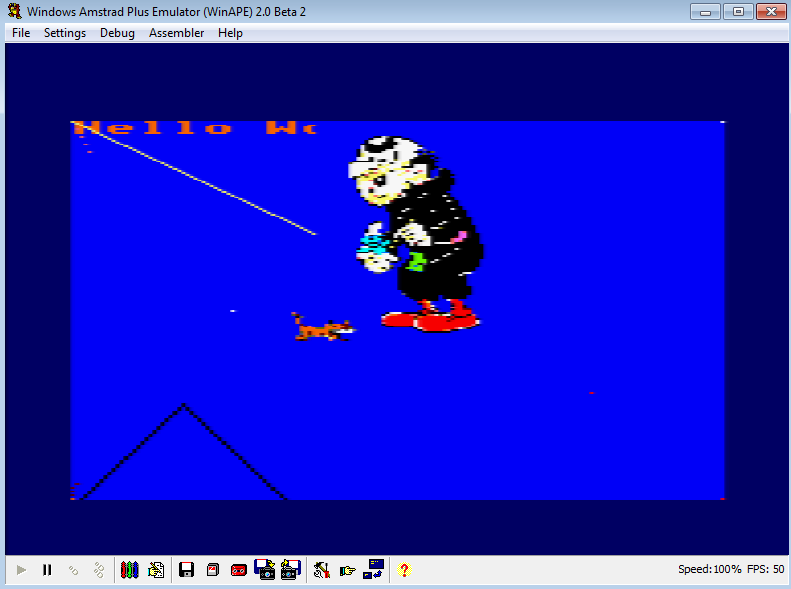

# [JDVA#5] ON AFFICHE ENFIN DES IMAGES, ET ON COMMENCE A RANGER NOTRE CODE
# Tested by Renaud

Basé sur la vidéo CPC de Oldschool is beautiful : http://www.youtube.com/watch?v=G0xANq3Y0jU

Je refactor un peu le code afin d'isoler les fonctions affichant une frame, du coup moi j'ai jdvapi_frame.h et jdvapi_frame.c
J'ai aussi deux GFX : poisson.c qui est le gfx de la vidéo, et azrael.c qui est le gfx que j'ai fabriqué lors du tutorial précédent.

A noter le #include "jdvapi_frame.h" et le #include "jdvapi_frame.c" au début de main.c (c'est sale mais ça marche...)

Je repose ici mon hello.c, qui comprendra mon main. Je modifie le _compil.bat afin d'insérer main.bin et hello.bin dans une seule disquette.

