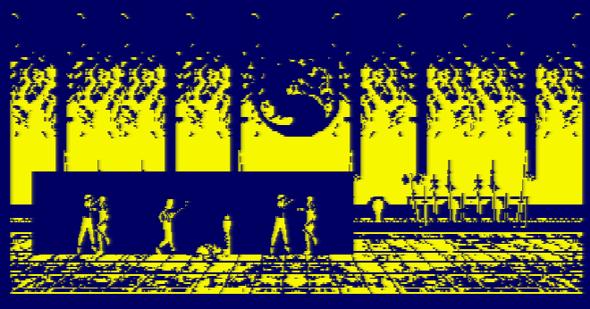

# [JDVA#6] ON FAIT BOUGER UN POULPE
# Tested by Renaud

Basé sur la vidéo CPC de Oldschool is beautiful : http://www.youtube.com/watch?v=88MaOZglJQA

__main.c jdva6.dsk__


__puzzmem.c jdva6.dsk__

Un vieux jeu que je jouais quand j'étais tout petit, je ne sais plus son nom, je l'ai recréé de mémoire. Un jeu de puzzle et de mémoire :


keys : ENTER, SPACE, arrows.

__combat.c jdva6.dsk__

J'utilise ici la technique du "décalage d'un pixel" afin que mes sprites bougent un pixel par un pixel en mode 2, changeant donc de sprite pixel par pixel sur un écran de 640 pixels de large. Et j'ai eu pas mal de surprises :

- En fait un écran ici fait 640 pixels de large, et est à 50Hz, donc si je met la vitesse maximal tout en déplaçant les pixels un par un à 50Hz, en fait mon personnage prend 6 secondes à atteindre le milieu de l'écran ! et c'est normal : (640/2)/25=12 secondes à 25Hz (donc humainement)

- A contrario changer de sprite à chaque fois, c'est trop rapide : mon bonhomme cours/clignote sur place. Voyons, il me faut 40 secondes pour atteindre le milieu de l'écran si à chaque appui on avance d'un pixel et qu'on bourrine sur la touche comme un malade (donc sans déplacement automatique). Donc au niveau du nombre d'action faites automatiquement par le déplacement du sprite à sa vitesse maxi, cette vitesse qui nous semble lente est 40/6=6 fois trop rapide. Dans quand je pensais que marcher était une action, tout comme donner un coup de poing dans mon jeu, je suis déjà 6 fois trop rapide niveau action, donc niveau sprite (je voulais un sprite par action...)

- Niveau perf, SDCC semble lacher l'affaire à partir d'un certain nombre de fonctions appelées par une fonction :
 error 9: FATAL Compiler Internal Error in file '/home/sdcc-builder
 /build/sdcc-build/orig/sdcc/src/z80/ralloc.c' line number '1354' : isSymbolEqual
 (sym, OP_SYMBOL (IC_RESULT (ic)))

- Niveau taille, le fichier final sature à 64KB, et ne marche plus un peu après les 32KB. Du coup j'arrive à avoir 64 sprites de 56x100 noir et blanc, mes 128 sprites ne rentrent pas ! De ce côté une solution serait de mettre les sprites dans un fichier à part, et tant qu'à faire les charger dans des bank RAM de la mémoire externe. Et tant qu'à faire se baser sur une seule image (de sprites non tous verticalement...) que je découpe lors du passage entre le format fichier et format RAM.

- Niveau perf, je peux afficher 2 sprites de 56x100 pendant un vsync, au delà ça sature. Mais bon on peut mettre deux vsync vue qu'on est à 50Hz... au dela il faudrait s'organiser (utiliser deux zones écran qu'on alterne ?)


Donc le poisson... il prend 1.5 secondes à traverser l'écran, sautant un pixel sur deux en mode 0 (écran de 160 pixels de large), disons sur un écran de 30 cm, donc il se déplace visuellement à 0.75km/h maximum (si on ne saute pas plus de pixels)

Et si on le compare à un vrai poisson, 8 fois plus grand donc, il ferait du 6km/h.

__combat2.c jdva6_combat2.dsk__

Petite discussion avec MiGaNuTs (mode warrior on :p)

Ce serait bien pour "combat" de jongler avec deux zones d'affichage histoire d'avoir un buffer, .

J'ai calculé que pour une action (marcher/taper), 50Hz pour un sprite c'est humainement 6 fois trop rapide, donc j'aurai logiquement le temps de calculer une superposition de deux calques.

Mais niveau rendu, faudrait afficher ça d'un coup, on a beau se dire qu'un humain voit à 25Hz et que donc je peux poutrer les sprites durant deux vsync, c'est quand même une plus belle qualité si les pixels bougent tous en même temps.

http://www.cpcwiki.eu/index.php/Retro_Game_Asset_Studio - avec "View sprite animation preview at any frame rate"

http://github.com/lronaldo/cpctelera - comprend la dernière version de Retro_Game_Asset_Studio

Gimp si on tire une règle sur le dessin, ça fait des zones, et lorsqu'on utilise l'outil de sélection, en fait il est magnétisé par la règle, ce qui facilite les sélections. De plus on peut travailler sur une sélection, ce qui empèche de baver d'un sprite sur l'autre.

Penser à utiliser Excel pour savoir/calculer où positionner régulièrement la règle :P

Lorsqu'on copie/colle un sprite sur Gimp et que le magnétisme de la règle pose soucis, utiliser les flèches du clavier pour déplacer le sprite plus facilement (un pixel par un pixel)

https://cpcrulez.fr/coding_amslive10-memoire_du_cpc_2.htm de la mémoire libre par défaut en &4000-&7FFF...

Réorganisation de mémoire (utile ?)
```
MEMORY HIMEM-233:LOAD "aa.rsx",HIMEM+1:CALL HIMEM+19
```

Utilisation de deux calques
```
mode 0
poke &C000, 255
// ho un pixel
poke &4000, 255
OUT &BC00,12
OUT &BD00,48
// je suis en C000 (normal)
OUT &BD00,16
// je suis en 4000 youpi
// ho un pixel, et pas de texte...
OUT &BD00,48
// je suis en C000 (normal)
```

http://tj.gpa.free.fr/html/coding/cpc_ram.htm - il suffit de faire un OUT &7F00,&CX où x correspond au bloc mémoire désiré.
```
OUT &7F00,&C0
// RAM rétablie
OUT &7F00,&C1
// RAM_7 sur &C000-&FFFF
OUT &7F00,&C4
// RAM_4 sur &4000-&7FFF
OUT &7F00,&C5
// RAM_5 sur &4000-&7FFF
OUT &7F00,&C6
// RAM_6 sur &4000-&7FFF
OUT &7F00,&C7
// RAM_7 sur &4000-&7FFF
```
Les autres combinaisons semblant un peu trop warrior (on perd les pieds sur la zone de programme)

Scrolling via offset CRTC (byte pas byte donc en théorie 2 pixels par 2 pixels en mode 0, en pratique : 4 pixels par 4 pixels car le clock est branché sur le dernier fil d'adresse...)
```
mode 0
OUT &BC00,13
OUT &BD00,0
OUT &BD00,1
OUT &BD00,2
OUT &BD00,3
```
Pour du vrai scroll, va falloir corriger ces 4 derniers pixels via du soft, pas du hard.

http://www.cpcmania.com/Docs/Programming/Files.htm - Loading files from disk using firmware (C & ASM with SDCC)

Retour de tests :

* J'ai réussi un découpage de sprites, j'ai du coup 13*4 sprites de 48x50 pixels noir et blanc, sur 4 RAM supérieures, du coup j'ai bien chargé mes 128 sprites !

* J'arrive aussi à avoir de la transparence, en mode 0 avec un 0R assembleur lors du set_frame, ce OR assembleur devrait marcher aussi en mode 1 si on est malin (en choisissant 0 noir, 1, 2, 3 une couleur mélangeant 1 et 2)

* J'ai des messages "so said EVELYN the modified DOG" quand je pousse l'algo principal (main) trop loin, et à partir de là c'est indéterministe la compilation en fait (le jeu marche un peu puis plouf), contre ça faut précéder la déclaration de ses variables par "volatile", ce que je fais pour toutes celles de mon main désormais.

* Avec ConvImgCpc, en mode 2, c'est plus facile d'avoir une image net si on force la palette (cocher dessous les deux première couleurs), avec des couleurs en bleu, car l'Amstrad a plus de dégradé en bleu, du coup il y a plus de chance d'avoir quelque chose de net, une fois OK, inverser les deux couleurs sur la couleur 0 (la première de la liste) n'est pas celle du fond du sprite et réappuyez sur recalculer.



https://www.spriters-resource.com/snes/mortalkombat2/sheet/41023/

__raster.c jdva6_combat2.dsk__

J'ai trois tests ici :
* en utilisant le set_palette (via le firmware) : bah ça raster pas, on a une seule couleur affichée.
* en utilisant des interrupts avec des halt : ça marche, mais on remarque au passage que vsync() il semble halt aussi.
* en utilisant une fonction C en callback : ça marche très très bien.

C'est inspiré grandement du travail de norecess : http://norecess.cpcscene.net/using-interrupts.html

__musique.c musique.dsk__

C'est un mixage entre la version original de grimware (STarKos !) et l'exemple de CPCTelera

J'ai installé CPCTelera, avec ses 5Go bouffé par un cygwin de fond, je fais juste "cd exemple", puis make et zou, dans exemples/medium/audio j'ai un bon exemble de disquette prète avec une musique qui se joue lors du lancement d'un programme. Une fois l'exemple extrait, j'ai désintallé CPCTelera...

Donc ici ça fait la même chose que l'exemple de CPCTelera (clavier, SFX, musique molusk.aks) avec comme originalité le border-raster (provenant du code côté Grimware) afin de chronométrer le programme, et le fichier son binaire dans un fichier à part (routine disquette provenant de CPCMania)

__musique2.c musique.dsk__

Alors là je fais pareil que musique.c sans les SFX, mais avec une autre musique. Le tout ici est de trouver et savoir convertir une musique SKS.

Alors pour ça j'ai récupéré "arkosTracker-1.0" de CPCTelera/tools, ce qui me permet de créer me fichier son voulu (en .bin), remarquez le "4000" dans le nom du fichier que j'ai employé, en fait je charge ce fichier en &4000 (via la routine disquette), et lorsque je crée mon .bin via "arkosTracker-1.0" en fait il me pose cette question, d'emplacement mémoire, je met donc 4000 à ce moment.

Pour récupérer une musique .SKS, j'ai pris "Arkos Tracker 2" http://www.julien-nevo.com/arkos/arkos-tracker-2-0-alpha/ et j'ai visité son dossier song/STarKos.

__musique3.c musique.dsk__
Alors là en mode furieux, j'ai tenté de traduire le player sks de Grimware en assembleur digeste pour du SDCC : donc de sks.player.asm (assembleur WinAPE) vers sks.player.s (assembleur SDCC), et bien ça compile, et bin ça a même été lancé une fois par chance avec des krrr krrr mélodique ma fois, mais j'ai pas réussi à geler la version. Donc ce musique3.c il ne marche pas (mais compile pourtant), traduire 1900 lignes de code assembleur en 4 heures c'était peut-être trop court :D

__musique4.c musique.dsk__
Non mais ho, le sks.player.asm (présent au passage dans /musique) il me plait, il marche bien sur WinAPE pourquoi je n'arriverai pas à l'utiliser moi dans mes projets ?

J'ai compilé (bouton assembler) le code de sks.player.asm en zone &3000, et j'ai dump un boque de &1000 (suffisant pour comprendre tout le code de sks.player.asm, pour cette manipe j'invite à merger (winmerge) les fichiers sks.player.asm et sks.player.sks3000.asm

Ensuite sous SDCC, j'ai inséré ce sks3000.bin en &3000, puis le son (.SKS compilé vers .BIN cette fois ci via le tool "GS" de la disquette STarKos 1.2) en &4000.

J'ai remarqué que la routine me change des variables (sans ma permission) de type volatile en début de mon main(), du coup je déclanche des fonctions avec les mêmes protections que j'avais utilisé en fait pour la fonction callback de raster.c

__combat2.c analyse gameplay__

32 sprites par joueurs

Collés sur la droite pour le joueur 1 de gauche : Liu Kang

Collés sur la gauche pour le joueur 2 de droite : Sub-Zero

couleur bleu si Sub-Zero mène, sinon rouge. Rouge au début du jeu.

border qui se met à la couleur du dernière qui a appuyé sur une touche, noir dès que relâché

Coups : haut, bas, milieu, porté si lancé dans zone de contact (superposition de quelques pixels des calques)

Ne peux pas sortir de la zone de jeux. Jeux purement horizontal (pas de sauts), "mur aux deux extrêmes".

Paliers énergétique :

* F : Furie, attaque avec un maximum de coups en un minimum de temps avec tout les coups qui gagnent, ++ lors attaque (voir règle en bas) et rebaisse selon le temps
* A : Aura, zen altitude, contre un maximum de coups avec une aisance avec tout les coups qui contrent, ++ lors defense (voir règle en bas) et rebaisse selon le temps
* E : Expert, diversifie ses attaques/défenses gagnantes, ++ lors différentes attaque/défenses (voir règle en bas) et rebaisse selon le temps

* TA : techniques attaques Gagnante/Perdante (parmis haut, bas, milieu) portant ou pas (additif : on a un graphique qui part du milieu et ++ vers le bas pour Perdant, et ++ vers le haut pour Gagnant)
* U : techniques utilisées (parmis haut, bas, milieu)

Arme (jet de dès au début du jeu) :
* haut : 4
* bas : 1
* milieu : 2

Barre de vie (classique !)

La Furie augmente la valeur des armes (par jet de dès additif), si la barre de Furie est pleine, il faut utiliser l'attaque la plus chargée (dans TA gagnant, TA est alors consommé) afin de déclancher la Furie sur une arme, sinon elle ne se déclanche pauvrement. En gros une TA progresse en même temps que F lorsqu'on bourine.

L'Aura débloque l'animation "super pouvoir", qui multiplie par (TA gagnant + TA perdant + F + E) la prochaine attaque utilisée, cette attaque est alors forcément gagnante (animation)

L'Expert augmente la valeur des armes (par jet de dès additif), il n'y a pas a choisir l'attaque afin de déclencher Expert, la moyenne de TA étant utilisé ici (et consommée) et appliqué à l'arme utilisé.

Bref Expert est plus dur à remplir, c'est un bonus à Furie mais qui demande plus de réflexion et rend plus difficile le déblocage de Furie (contrairement à une méthode de bourins)

Un joueur peux être KO, s'il n'y a eu aucune attaque ou contre porté parmis les 10 dernières actions globales du jeu.

Le mieux serait d'avoir plusieurs attaques : à animation courte ou longue, les courtes permettant de contrer. Les courtes au milieu (vers l'avant les longues, et en reculant les ???)

Une attaque est une action, donc une animation de sprites. Si une attaque est contrée, l'animation contrée est stoppée net.

Si une attaque est portée, la defense en court est stoppée net.

Si les attaques sont simultanées (à 2 actions près), les deux coups sont portées.

Une attaque contrée pique les points d'attaque de l'adversaire et les déversent dans Aura.

Une attaque portée déverse ses points dans Furie si c'est la 5ème attaque portée parmis les 10 dernières actions globales du jeu.

Une attaque portée déverse ses points dans Expert si les 3ème attaques portée sont tous différentes.

Une attaque portée, fait reculer l'autre personnage (et avancer l'attaquant)

Déplacement : avancer deux fois plus vite que reculer, le déplacement est continu, il est imédiat lors du premier appuis sur la flèche puis continue, et stop net (ne fais pas le pas si pas fini de tictac entre deux positions)