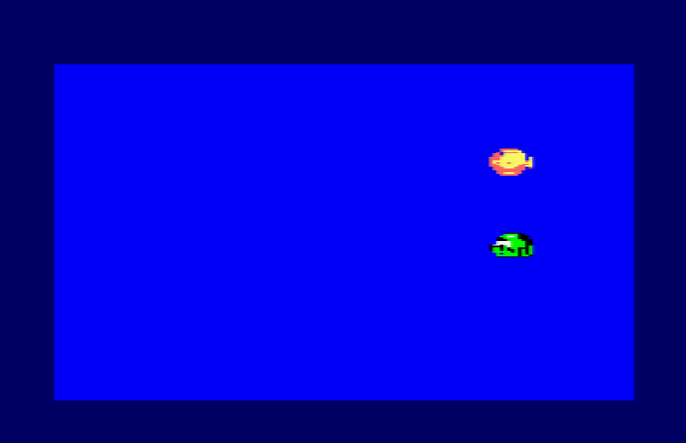
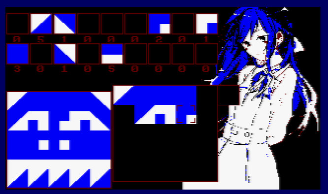
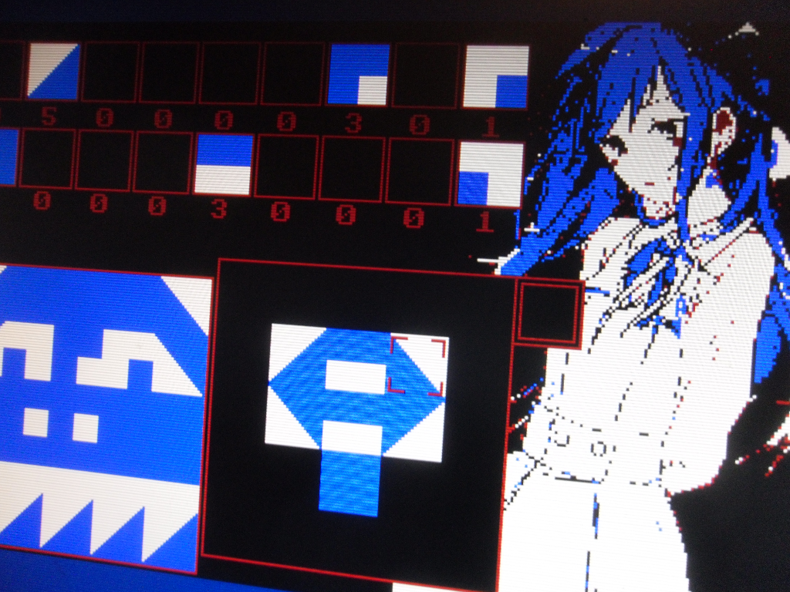
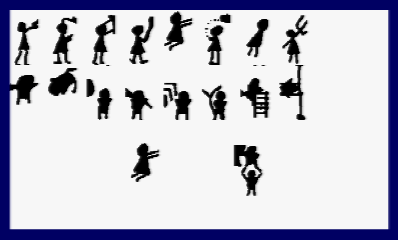

# [JDVA#6] ON FAIT BOUGER UN POULPE
# Tested by Renaud

Basé sur la vidéo CPC de Oldschool is beautiful : http://www.youtube.com/watch?v=88MaOZglJQA

Un vieux jeu que je jouais quand j'étais tout petit, je ne sais plus son nom, je l'ai recréé de mémoire. Un jeu de puzzle et de mémoire :

keys : ENTER, SPACE, arrows.

combat

J'utilise ici la technique du "décalage d'un pixel" afin que mes sprites bougent un pixel par un pixel en mode 2, changeant donc de sprite pixel par pixel sur un écran de 640 pixels de large. Et j'ai eu pas mal de surprises :

- En fait un écran ici fait 640 pixels de large, et est à 50Hz, donc si je met la vitesse maximal tout en déplaçant les pixels un par un à 50Hz, en fait mon personnage prend 6 secondes à atteindre le milieu de l'écran ! et c'est normal : (640/2)/25=12 secondes à 25Hz (donc humainement)

- A contrario changer de sprite à chaque fois, c'est trop rapide : mon bonhomme cours/clignote sur place !

- Niveau perf, SDCC semble lacher l'affaire à partir d'un certain nombre de fonctions appelées par une fonction :
 error 9: FATAL Compiler Internal Error in file '/home/sdcc-builder
 /build/sdcc-build/orig/sdcc/src/z80/ralloc.c' line number '1354' : isSymbolEqual
 (sym, OP_SYMBOL (IC_RESULT (ic)))

- Niveau taille, le fichier final sature à 64KB, et ne marche plus un peu après les 32KB. Du coup j'arrive à avoir 64 sprites de 56x100 noir et blanc, mes 128 sprites ne rentrent pas !

- Niveau perf, je peux afficher 2 sprites de 56x100 pendant un vsync, au delà ça sature. Mais bon on peut mettre deux vsync vue qu'on est à 50Hz... au dela il faudrait s'organiser (utiliser deux zones écran qu'on alterne ?)

Donc le poisson... il prend 1.5 secondes à traverser l'écran, sautant un pixel sur deux en mode 0 (écran de 160 pixels de large), disons sur un écran de 30 cm, donc il se déplace visuellement à 0.75km/h maximum (si on ne saute pas plus de pixels)