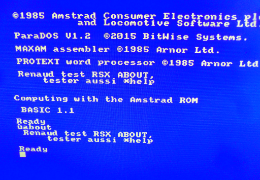

# [JDVPA#10] Une histoire de collision.
# Tested by Renaud

Basé sur la vidéo CPC de Oldschool is beautiful : http://www.youtube.com/watch?v=20hd40AN4D4

__main.c jdvpa10.dsk__

Si un ennemi nous touche, simple retour du pacman à la position de départ.

Quelques glitsh mais globalement ça le fait, la suite au prochain épisode.

glitchs corrigés.

__RSXABOUT.ROM__

Premier test de RSX, calibré.

__CWTAROM.ROM__

Autre test de tuto RSX, ok : http://www.cantrell.org.uk/david/tech/cpc/CWTA-writing-ROMs.html
