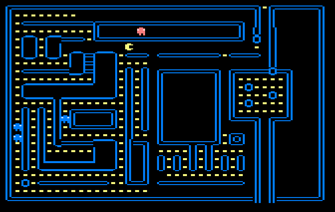
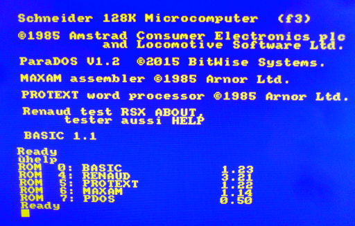

# [JDVPA#10] Une histoire de collision.
# Tested by Renaud

Basé sur la vidéo CPC de Oldschool is beautiful : http://www.youtube.com/watch?v=20hd40AN4D4

__main.c jdvpa10.dsk__

Si un ennemi nous touche, simple retour du pacman à la position de départ.

Quelques glitsh mais globalement ça le fait, la suite au prochain épisode.

glitchs corrigés.

__RSXABOUT.ROM__

Premier test de RSX : ça affiche dans le welcome et dans la liste des ROM, mais ùabout ne se lance pas.