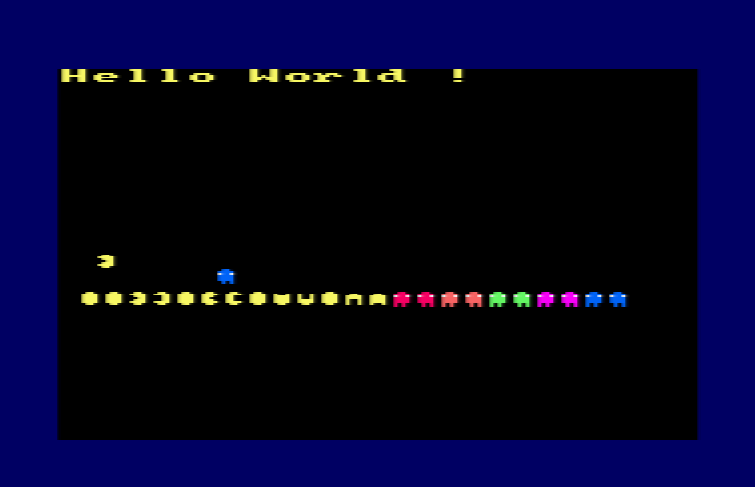

# [JDVPA#1] Rond comme un ballon et plus jaune qu'un citron
# Tested by Renaud

Basé sur la vidéo CPC de Oldschool is beautiful : http://www.youtube.com/watch?v=t5kcqXJvBmI

__main.c jdvpa.dsk__

Bon ici on affiche des sprites, comme déjà présenté lors de précédents épisodes. Pour mon grain de sel, je vais simplement écrire un script qui transforme automatiquement ces fichu fichier image .asm de ConvImgCpc vers des .c/.h adéquats.

Le meilleur langage pour transformer du texte en texte, c'est perl.

http://www.activestate.com/activeperl

Je prend la version 5.22.4.2205 en 64bit windows.

__ConvImgCpc_asm2c.pl__
Dans _compil.bat je lance :

 perl ConvImgCpc_asm2c.pl Pacman_reduce.asm

qui génère automatiquement pacman_reduce_sprites.c et pacman_reduce_sprites.h, plus besoin de faire ça à la main :)