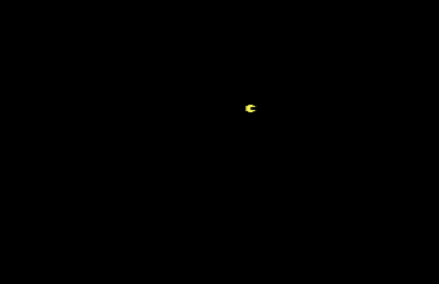
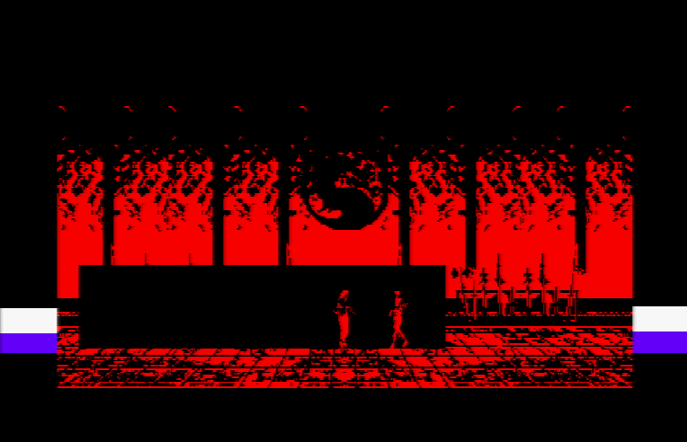

# [JDVPA#2] C'est le pacman !
# Tested by Renaud

Basé sur la vidéo CPC de Oldschool is beautiful : http://www.youtube.com/watch?v=5lgHTfqISnk

__main.c jdvpa2.dsk__

Le pacman bouge bien, via les touches A,Q,O,P.

__combat2.c jdvpa2_combat2.dsk__

Pour le moment combat2.c contient une structure constante pour l'énumération des calques, ce qui permet d'avoir l'offset et le nombre de calques utilisé par une animation : J2R.hadouken2_fire.o (offset) et J2R.hadouken2_fire.l (lenght)

L'objectif va être de rajouter le clavier et faire bouger 2 personnages.

Liu Kang : QAWE (querty) + space

Sub Zero : IKOP + L

Le border raster permet de chronométrer les routines exécutées lors de l'affiche d'une image, en blanc le temps dédié au son (moins d'une interruption), et le violet le reste des calculs (affichage des bonhommes, transfert mémoire)

L'algo de déplacement et d'animation de sprite commence à faire des trucs, pas tout bien, mais bon faut de toute façon que je le refasse car j'ai oublié quelques conceptes.

Finalement à la place du raster-border pour chronométrer mes algos pendant un vsync, j'ai opté pour un dog.

Un dog est quelque chose qui hara-kiri un programme lorsqu'il a été détecté inactif pendant un certain moment, en fait
 le principe est simple : par moment dans le programme on doit penser à nourrir le chien (appelle d'une fonction pour), et si on n'a pas nourri assez le chien pendant un certain moment, le chien détruit le programme (généralement il reboot la machine), c'est un concept connu en électronique, appelé "watch-dog".

Si mon algo rame trop ici et mange trop de vsync, alors mon programme commence à baver du violet au bord et rame grave.

J'utilise un sémaphore (c'est le nom scientifique), en fait l'interruption fait "is_vsync++", et dans le code je fais "while (is_vsync!=TEMPS_DE_MON_ALGO_EN_NB_DE_VSYNC) { if (is_vsync>TEMPS_DE_MON_ALGO_EN_NB_DE_VSYNC) {ouaf ouaf BOUM} } is_vsync=0;".