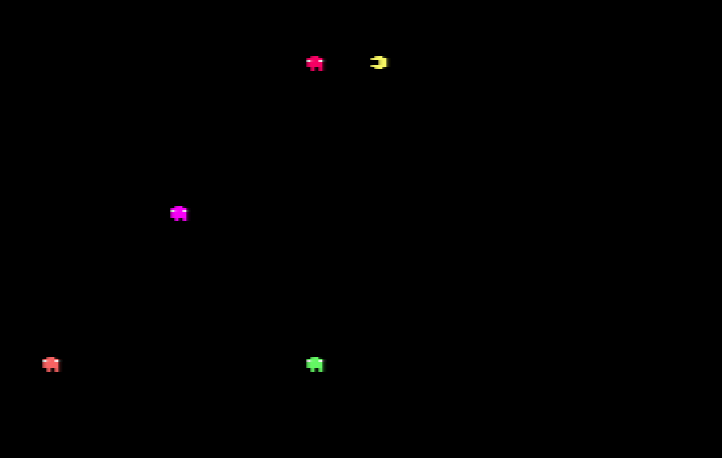
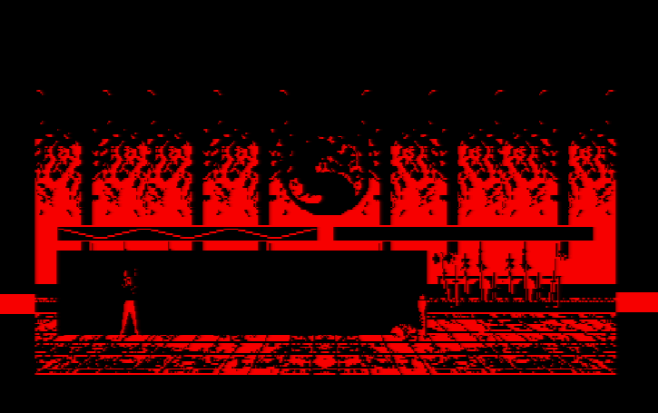

# [JDVPA#2] Fantômes gloutons !
# Tested by Renaud

Basé sur la vidéo CPC de Oldschool is beautiful : http://www.youtube.com/watch?v=-JEbmldjE4o

__main.c jdvpa3.dsk__

Pas de difficulté supplémentaire ici. On remarque cela dit le côté un peu "bot" (déplacement autonome), et qu'un fantôme est implémenté avec un algo semblable au pacman (struct, actions relatives)

__combat2.c jdvpa3_combat2.dsk__

Finalement seule la barre de vie est affichée, mais elle est dynamique (un peu lente, mais ça me va)

Le gameplay change : au niveau des cinématiques, on peut par calque de cinématique, dire si un coup est porté ou/et si un coup est contré.

Si un coup est contré, son dégat est remis à 0, et l'animation est gelée sur le dernier calque. Le joueur doit alors relancer un nouveau coup, en réappuyant par exemple sur FIRE.

Personnellement je pense qu'un contre est global : on ne contre pas en haut ou en bas, on contre tout simplement, du coup il n'y a pas de distinction niveau gameplay entre une attaque en haut et une attaque en bas, hormis justement les paramétrage des animations (calque par calque : PORTE et/ou CONTRE)

Un mur invisible a été ajouté entre les deux joueurs, effectivement les calques étant ici que d'un sens, il ne faut pas que le joueur se retrouve de l'autre côté du joueur. Ce mur permet aussi de calculer des projections de l'adversaire lorsqu'il reçoit un coup simple. Ou de reculer l'adversaire lorsqu'il reçoit un coup "entrant".

Il y a un "finish him" : le perdant lors d'un combat est KO, sa barre est reremplie à 25%, et lorsqu'elle retombe à 0% le perdant affiche un fatality, et le gagnant un victory.

Les contrôles sont au joystick seulement, la touche "N" relance une partie.

Un effort a été fait au niveau de l'utilisation des pointeurs (premièrement pour des questions de taille mémoire du programme), ainsi le mapping des touche est branché simplement sur des animations. Ces animations sont paramétrés. Par exemple :

mapping_direction_calque[PERSO_LIU_KANG][DIRECTION_GAUCHE | DIRECTION_FIRE]=&J1A.poing_milieu;

.poing_milieu={36,1,0,PORTE_EN_2,BANK_4,ALLEZ_RETOUR}

Alors ici, l'animation commence à l'offset 36 et dur deux calques, le second portant un coup, c'est une animation de type ALLEZ_RETOUR, donc la personne se positionne (calque 1), frappe (calque 2) et se rétracte (calque 1). Vue qu'elle n'est pas de type MARCHE alors c'est un coup sur place.