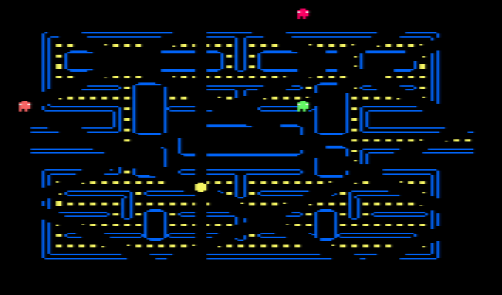
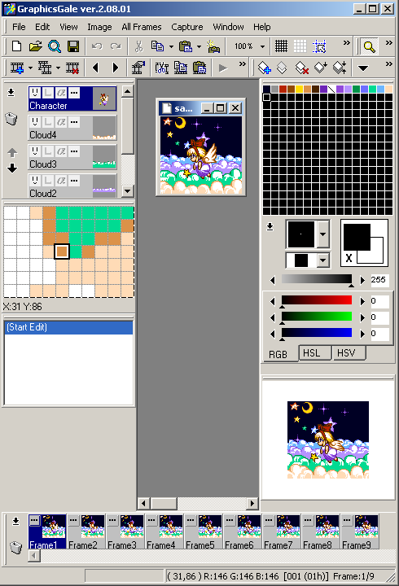
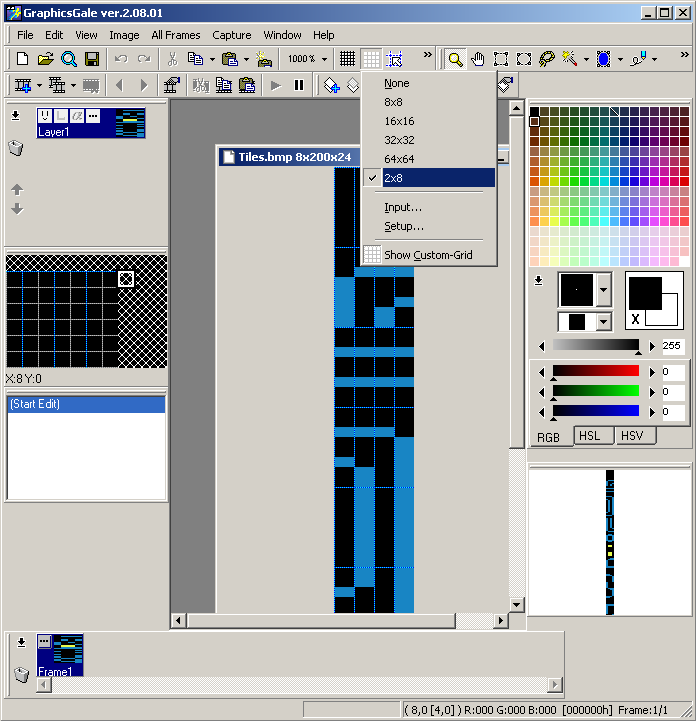
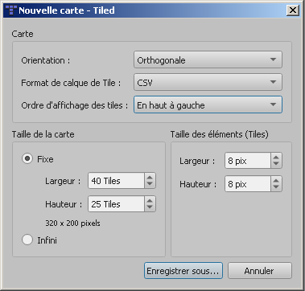
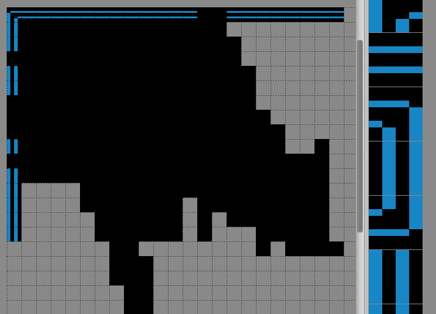
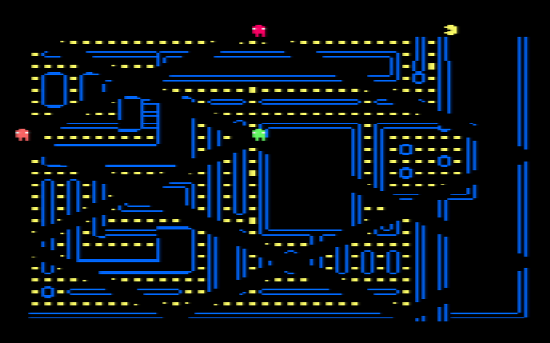
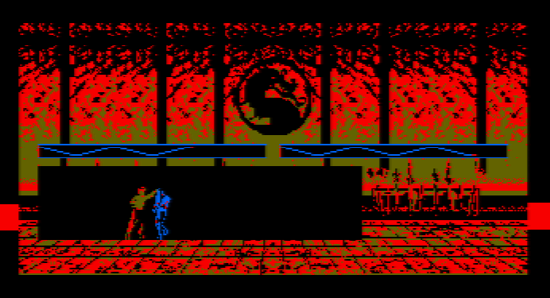
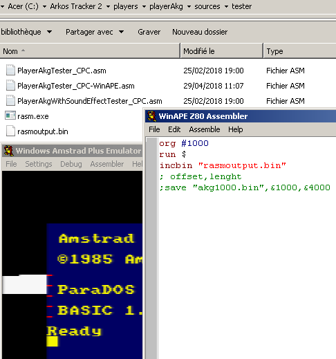

# [JDVPA#4] Le labyrinthe
# Tested by Renaud

Basé sur la vidéo CPC de Oldschool is beautiful : http://www.youtube.com/watch?v=NEontG3vo6o

__main.c jdvpa4.dsk__

GraphicsGale http://graphicsgale.com/us/download.html

Je prend : "Install version".

Si je fais ouvrir, ça propose d'ouvrir sample1.gal ou sample2.gal

Ouvrons "Tiles.bmp", hop.

Je rajoute une grille custom 2x8 (Setup>add dans cette sélection sourie)

Tiled http://www.mapeditor.org

Je prend : "Download at  itch.io" > "Tiled for Windows (64-bit), snapshot". Je décompresse le contenu dans C:\Program Files\tiled-windows-64bit-snapshot

L'exécutable est "tiled.exe"...

"Nouveau Tileset...">nom:"pacmanTileset",source:"tiles.bmp",largeur:"8px",hauteur:"8px">Enregistrer (ça crée pacmanTileset.tsx)

"Nouvelle carte...">largeur:"40 Tiles",hauteur:"25 Tiles",largeur:"8px",hauteur:"8px",ordreDAffichageDesTiles:"En haut à gauche" => ça confirme : 320x200 pixels>Enregistrer (ça crée labyPac.tmx)

menu Cartes>"Ajouter un Tileset externe...">choisir "pacmanTileset.tsx".

Cliquer bêtement sur une des tiles (en bas à droite) et puis ensuite sur la map (au milieu), ho ça marche.

perl Tiled_tmx2c.pl labyPac.tmx

permet de générer automatiquement labyPac_map.h et labyPac_map.c à partir de labyPac.tmx

__combat2.c jdvpa4_combat2.dsk__

Passage en mode 1 (4 couleurs), recentrage de quelques animations, révision de la zone de contact.

Ecriture de la bande sonore MK-BO.SKS par SuTeKH/Epyteor

__AKG Hello World__

Testons un Hello World AKG, Targhan dit qu'il y a un hello world dans le dossier testers/. Que tout ça se compile avec SJasmPlus ou Rasm... effectivement, ce n'est pas de la syntaxe assembleur WinAPE ici :/

http://www.roudoudou.com/rasm/rasm_fr.html

http://www.roudoudou.com/rasm/ http://www.cpcwiki.eu/forum/programming/rasm-z80-assembler-in-beta/ rasm_v086.zip rasm.exe

Je copie rasm.exe dans C:\Arkos Tracker 2\players\playerAkg\sources\tester et je glisse dessus "PlayerAkgTester_CPC.asm" j'obtiens alors rasmoutput.bin

Je crée un fichier "PlayerAkgTester_CPC-WinAPE.asm" toujours dans ce même dossier avec dedans :
<pre>org #1000
run $
incbin "rasmoutput.bin"
; offset,lenght
;save "akg1000.bin",&1000,&4000</pre>
Je lance WinAPE, F3 (show assembleur), j'ouvre PlayerAkgTester_CPC-WinAPE.asm, F9, OK, et là ça joue de la musique :)

__combat2m.c jdvpa4_combat2.dsk__

Ajout d'une musique MK.

Afin de convertir un mod en son CPC, j'utilise "Arkos Tracker 2" http://www.julien-nevo.com/arkos/arkos-tracker-2-0-alpha/

On peut lire les mod originaux avec https://milkytracker.titandemo.org/downloads/ afin de se faire une idée, j'utilise juste les boutons "Load", "Play Sng" et "Stop". Je mute les pistes 4 à 8 (il suffit de cliquer droite sur le numéro en haut de la piste) car à l'import le CPC va importer que les 3 premières voies. Quand on clique droit sur le haut d'une piste, il y a "Swap channels" qui permet d'échanger la piste avec la piste où on a posé le curseur clavier (flèche droite/gauche, le carré bleu)

avmk-mod.mod https://modarchive.org/index.php?request=view_by_moduleid&query=34353 est plutôt pas mal avec les pistes 2/3/4 mais pèse lourd 287KB.
mk_bo.mod https://modarchive.org/index.php?request=view_by_moduleid&query=52118 35KB est le plus petit que j'ai trouvé en mod... version bidouillé pour avoir que 3 voies : mk_bo-3voies-4cut.mod

Je lis mk_bo-3voies-4cut.mod sur Arkos Tracker 2, certains son ne sont pas pris en compte, certains sont mauvais, mais la batterie elle passe très bien elle, la voie (qui est aussi moche que l'original mk_bo.mod donc parfais), le timing est correct.

L'export choisi : AKY, en &3000, maigre fichier je trouve.

Bon faut jarter tout les "SAMPLES" et mettre des "FM". Je vais prendre pour le moment les "FM" de Solarium (sks), mais l'octave du coup est mauvais (trop aigu), faudrait réécrire toutes les notes hum.

J'utilise PlayerAkg2000.asm afin de générer akg2000.bin avec rasm.exe

J'utilise MK2-Solarium.aks afin de générer mk3000.bin

Bon ça marche, mais par contre du coup c'est très aigu.

__AKG SFX Hello World__

Dans C:\Arkos Tracker 2\players\playerAkg\sources\PlayerAkg.asm il faut mettre PLY_AKG_MANAGE_SOUND_EFFECTS à 1.

Je copie rasm.exe dans C:\Arkos Tracker 2\players\playerAkg\sources\tester et je glisse dessus "PlayerAkgWithSoundEffectTester_CPC.asm" j'obtiens alors rasmoutput.bin

Je crée un fichier "PlayerAkgTester_CPC-WinAPE.asm" toujours dans ce même dossier avec dedans :
<pre>org #1000
run $
incbin "rasmoutput.bin"
; offset,lenght
;save "akg1000.bin",&1000,&4000</pre>
Je lance WinAPE, F3 (show assembleur), j'ouvre PlayerAkgTester_CPC-WinAPE.asm, F9, OK, et là ça joue de la musique, appuyer sur 1/2/3 sur le clavier numérique à droite du clavier, ça joue des sons respectivement sur l'haut parleur gauche, les deux, l'haut parleur de droite.

__combat2e.c jdvpa4_combat2.dsk__

Ajout du SFX, 3 instruments créés.

Je rajoute des points d'ancrage dans PlayerAkg.asm :
<pre>;Hooks for external calls. Can be removed if not needed.
jp PLY_AKG_Init          ;PLY_AKG_Start + 0.
jp PLY_AKG_Play          ;PLY_AKG_Start + 3.
jp PLY_AKG_Stop          ;PLY_AKG_Start + 6.
jp PLY_AKG_InitSoundEffects ;+9
jp PLY_AKG_PlaySoundEffect ;+C</pre>
Je compile PlayerAkg2000.asm, j'obtiens akx2000.bin, akx2D20.akx comprend les SFX, je le place en adresse x2D20 juste après la fin de akx2000.bin en fait, car il est tout petit et ne dépassera pas l'adresse 3000, où je pose mk3000.bin (la musique de fond)

Quand les personnages s'infligent des dégats ça joue un instrument SFX.

__combat2i.c jdvpa4_combat2.dsk__
Test d'affichage inversé d'un sprite, utilisation d'un tableau de transposition pour les octets, ça prend un peu de temps de calcul mais ça va.
Pour la répartition de la charge j'ai pensé qu'un personnage était toujours affiché à l'inverse de l'autre, donc changer de sens n'est pas plus couteux.

Sinon niveau mémoire, j'ai lancé la fonction raster_halt() qui coupe le firmware RAM. Juste avant de lancer les fonctions de chargement disquette (qui elles sont en firmware ROM), et comme quand on écrit en ROM en fait on écrit en RAM, les fonctions de chargement disquette marchent très bien partout. J'ai donc chargé la routine son finalement en &8000 et la bande son en &9000, ce qui me libère 8Ko de plus pour le programme (et +4Ko pour le son si besoin), donc du coup l'espace occupé par mon programme n'est plus 100%, mais 50% donc je peux... aller plus loin :)
