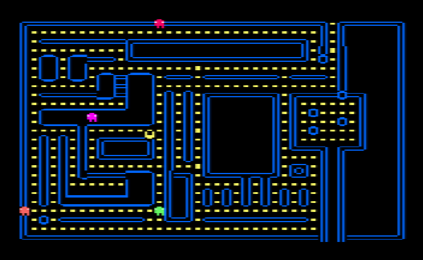
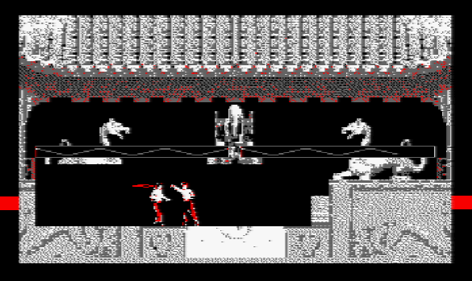
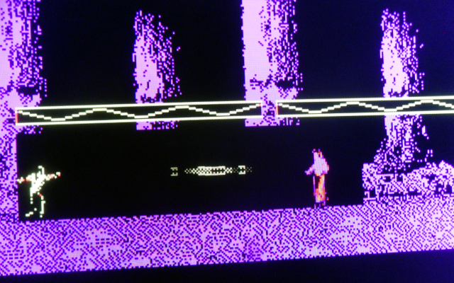

# [JDVPA#5] Pseudo sprites
# Tested by Renaud

Basé sur la vidéo CPC de Oldschool is beautiful : http://www.youtube.com/watch?v=b9hb3fNhAgQ

__main.c jdvpa5.dsk__

J'ai bêtement ajouté "if (i==1 || i==3) vsync();" pour capturer l'écran, mais du coup ça ralenti.

Mais comme dit dans la vidéo, le nombre de sprite une fois qu'ils marcheront dans le labyrinthe, sera presque divisé par deux.

__combat2.c jdvpa5_combat2.dsk__

___put_inversed_frame()___

Les personnages peuvent changent de sens lorsqu'ils se croisent.

Affichage inversé d'un sprite, utilisation d'un tableau de transposition pour les octets, ça prend un peu de temps de calcul mais ça va.
Pour la répartition de la charge j'ai pensé qu'un personnage était toujours affiché à l'inverse de l'autre, donc changer de sens n'est pas plus couteux.

__COMBAT2.BAS___

J'ai créé un menu afin de passer quelques paramètres de basic vers asm :
* le choix de la partie : "Liu Kang vs Sub Zero", "Johnny Cage vs Scorpion", "Sonya vs Kano". Chacun change le fond, les perso et la palette, la palette de 4 couleurs (mode 1) étant : noir, rouge, neutre, adversaire (rouge étant généralement aussi le héro), ou noir, rouge, hero, adversaire.
* le mode "ARCADE" : ça permet de jouer avec les deux boutons.

___blood()___

Un effet type particules, qui marche un peu.

___hadouken()___

Un autre effet type particules, qui marche un peu.

TODO :
* OSEF rendre paramétrable le choix des joueurs, mais faire des préselection dans le menu basic
* OSEF terrain paramétrable aussi.
* DONE image dernier terrain OK, mais zone de combat : le 1 est OK, la foret devrait être plus large, et le dernier plus court/centré (genre arène) 
* DONE ajouter 2 sons (OSEF choix paramétrable aussi), dont le son du prototype
* DONE calibrer algo inverse sprite, empécher lock
* finaliser hadouken (dégats, et cible mouvante)
* DONE AI : direction = (old_direction+rnd) à la place de  direction = rnd + mélange
* peaufiner algo sang
* DONE optim/debug PHASE_GEL (ne pas utiliser NON_CYCLIQUE+fin anim ? pour ça ?)

__COMBAT2.BAS__

Passage de COMBAT2.BAS en mode texte, afin d'être éditable sous notepad++ :
<pre>load "combat2.bas"
 save "combat2.bas",a</pre>
Si on ouvre avec notepad++, on peut garder juste le texte + le dernier caractère étrange "(SUB)" (sinon on a Line too long)
