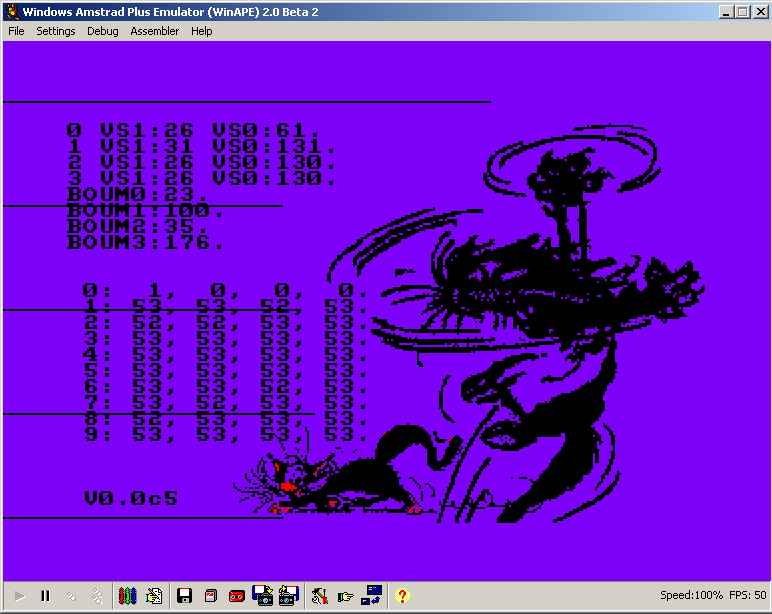

# [JDVPA#6] Gestion des Collisions entre Pacman et le labyrinthe
# Tested by Renaud

Basé sur la vidéo CPC de Oldschool is beautiful : http://www.youtube.com/watch?v=WJNG2xuLHXM

__main.c jdvpa6.dsk__

Ajout d'un gameplay à la "Oh Mummy !" pour les déplacements en zig zag.

__moustache.c jdvpa6_moustache.dsk__

Testbench for calibrating CPC on my MiST-board :
* VSYNC test : first array of value are around respectively length of VSYNC at 0 and length VSYNC at 1, each column does start at different NOPs offset.
* BOUM VSYNC test : does change a register in CRTC during measure of VSYNC length, this way can detect perhaps delay between setting CRTC register value and getting VSYNC output signal in consequence. Normaly the cat does shake, but it does.
* interrupt test : second array does increment index of array, and between two interrupt array value is simply incremented one per one. Each column does start at different NOPs offset.
* palette raster : the cat must catch the horizontal line.