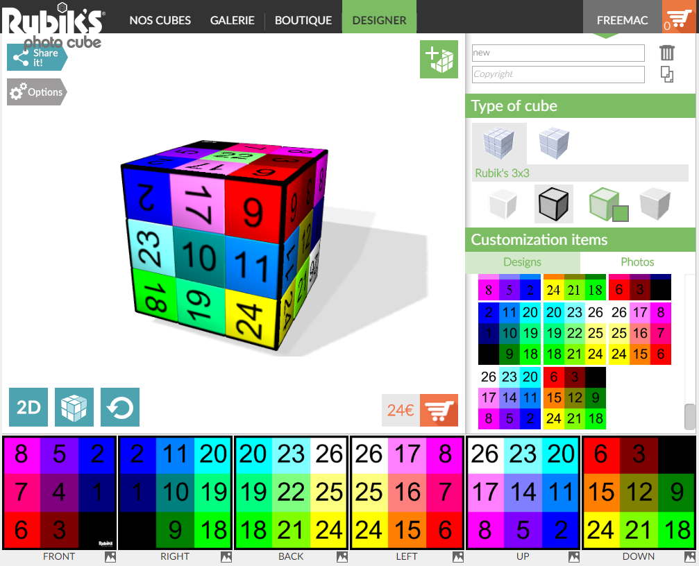

# RubikCubePaletteCPC
Inspiré d'une vidéo CPC de MacDeath26 : http://www.youtube.com/watch?v=iMo0bCSMAQ0

RubikCube aux couleurs de la palette CPC qu'on peut acheter physiquement en utilisant le site suivant : http://www.rubiksphotocube.com/fr/designer




Le RubikCube est assez petit par rapport à un RubikCube original mais ça va. A l'intérieur c'est blanc (quand on commence à faire tourner un axe). J'ai imprimé les deux versions, avec ou sans chiffres, sans chiffre je trouve ça nul en fait, car de toute façon il va finir par être mélangé. Avec les chiffres, c'est assez cool. Bon les couleurs ne semble pas 100% parfaite (le rouge fait un peu marron), mais ça fait la chose, comme je vais le démontrer ici.

Prenons une image, par exemple ici un morceau de l'affiche du [THSF 2017](http://www.thsf.net/), taillé en 640x400.


Je retouche l'image avec Gimp, en commençant par un clique droit Couleurs>Maximum RVB. J'épaissie et isole quelques traits : en utilisant Gimp je sélectionne ce qui entoure un dessin (pas les traits mais le fond), puis je fais Gimp>Sélection>Inverser (ça sélectionne les traits), puis enfin Gimp>Sélection>Agrandir... 1 pixel. Je donne un bon coup de pinceau noir, puis je refais Gimp>Sélection>Inverser (ça sélectionne le fond), je donne un bon coup de pinceau blanc.

Sous MSPAINT, j'enregistre en bmp 16bit.

Après on peut l'utiliser pour sélectionner les INK d'une image CPC créé via ConvImgCpc :

ConvImgCpc [amstrad.eu](http://amstrad.eu/modules/TDMDownloads/) > [ConvImgCpc](http://amstrad.eu/modules/TDMDownloads/singlefile.php?cid=13&lid=186)


Puis Transférer le fichier image.scr résultat sur une disquette via ManageDsk :

ManageDsk [amstrad.eu](http://amstrad.eu/modules/TDMDownloads/) > [ManageDsk](http://amstrad.eu/modules/TDMDownloads/singlefile.php?cid=13&lid=187)


Puis écrire un petit script basic directement sur le CPC pour afficher l'image :
```10 MODE 0
20 BORDER 0
30 INK 0,11:INK 1,8:INK 2,20...
40 LOAD"image.scr",&C000
50 CALL &BB18
save"hop.bas
```
Ici j'utilise le RubikCubePaletteCPC pour remplir la palette ligne 30 avec les couleurs de la palette affiché en bas de ConvImgCpc.

Et j'obtiens finalement sur l'Amstrad CPC, lors d'un run :

