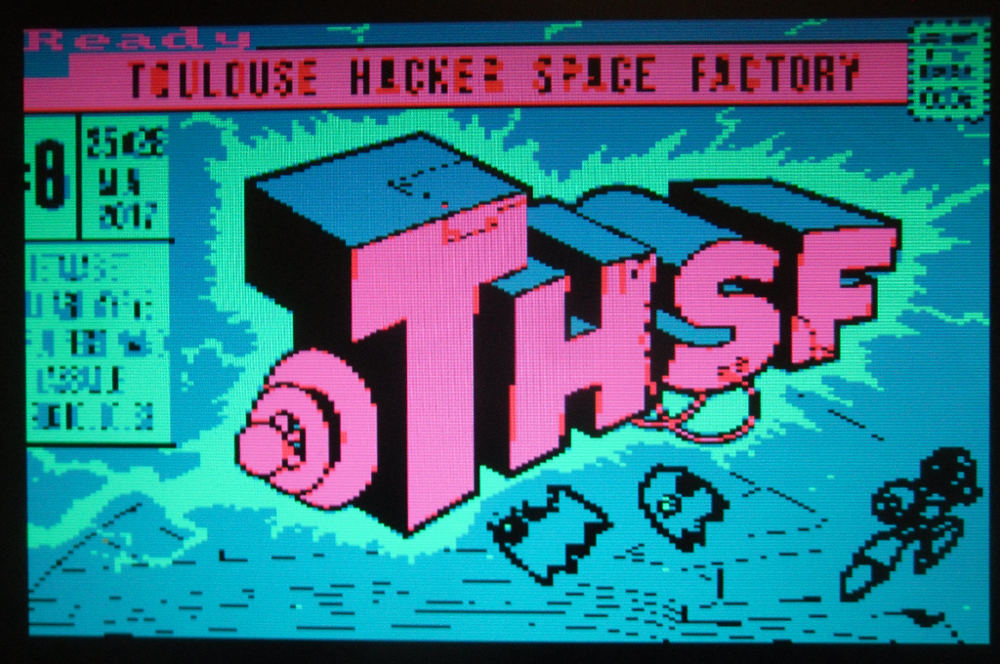

# RubikCubePaletteCPC
Inspiré d'une vidéo CPC de MacDeath26 : http://www.youtube.com/watch?v=iMo0bCSMAQ0

RubikCube aux couleurs de la palette CPC utilisable pour le mapping des couleurs d'une image CPC.

On peut l'acheter physiquement en utilisant le site suivant : http://www.rubiksphotocube.com/fr/designer


J'ai testé, le RubikCube est assez petit par rapport à un RubikCube original (mais du coup on peut le spin dans la main). A l'intérieur c'est blanc (quand on commence à faire tourner un axe). Avec les chiffres, c'est assez cool : on s'en fou que ce soit mélangé, à noter que le cube 13 (le gris) et "au milieu" du RubikCube. Bon les couleurs ne semblent pas 100% parfaite (le rouge fait un peu marron, ça viendrait de mon pattern ?), mais ça fait la chose, comme je vais le démontrer ici.

Prenons une image, par exemple ici un morceau de l'affiche du [THSF 2017](http://www.thsf.net/), taillé en 640x400.


Je retouche un minimum l'image avec Gimp, en commençant par un clique droit Couleurs>Maximum RVB. J'épaissie et isole quelques traits : en utilisant la baguette magique dans Gimp je sélectionne ce qui entoure un dessin (pas les traits mais le fond), puis je fais Gimp>Sélection>Inverser (ça sélectionne les traits), puis enfin Gimp>Sélection>Agrandir... 1 pixel. Je donne un bon coup de pinceau noir, puis je refais Gimp>Sélection>Inverser (ça sélectionne le fond), je donne un bon coup de pinceau blanc.


Sous MSPAINT, j'enregistre en bmp 16bit.

ConvImgCpc est utilisé pour transformer une image BMP en image SCR (image pour Amstrad CPC), en bas de ConvImgCpc on a une palette CPC affichée, le RubicCubePaletteCPC va être utilé justement pour mapper cette palette (la liste des INK) dans le programme basic final :

ConvImgCpc [amstrad.eu](http://amstrad.eu/modules/TDMDownloads/) > [ConvImgCpc](http://amstrad.eu/modules/TDMDownloads/singlefile.php?cid=13&lid=186)


Je transfère le fichier image.scr résultant sur une disquette (fichier .DSK) via ManageDsk :

ManageDsk [amstrad.eu](http://amstrad.eu/modules/TDMDownloads/) > [ManageDsk](http://amstrad.eu/modules/TDMDownloads/singlefile.php?cid=13&lid=187)


J'écris finalement un petit programme basic directement sur le CPC pour afficher l'image (inspiré du script d'Antoine R sur fb Amstrad.eu) :
```
10 MODE 0
20 BORDER 0
30 INK 0,11:INK 1,8:INK 2,20...
40 LOAD"image.scr",&C000
50 CALL &BB18
save"thsf2017.bas
```
Ici j'utilise le RubikCubePaletteCPC pour remplir la palette ligne 30 avec les couleurs de la palette affichée en bas de ConvImgCpc.

Et j'obtiens finalement sur l'Amstrad CPC, lors d'un run :



[thsf2017.dsk](thsf2017.dsk)
